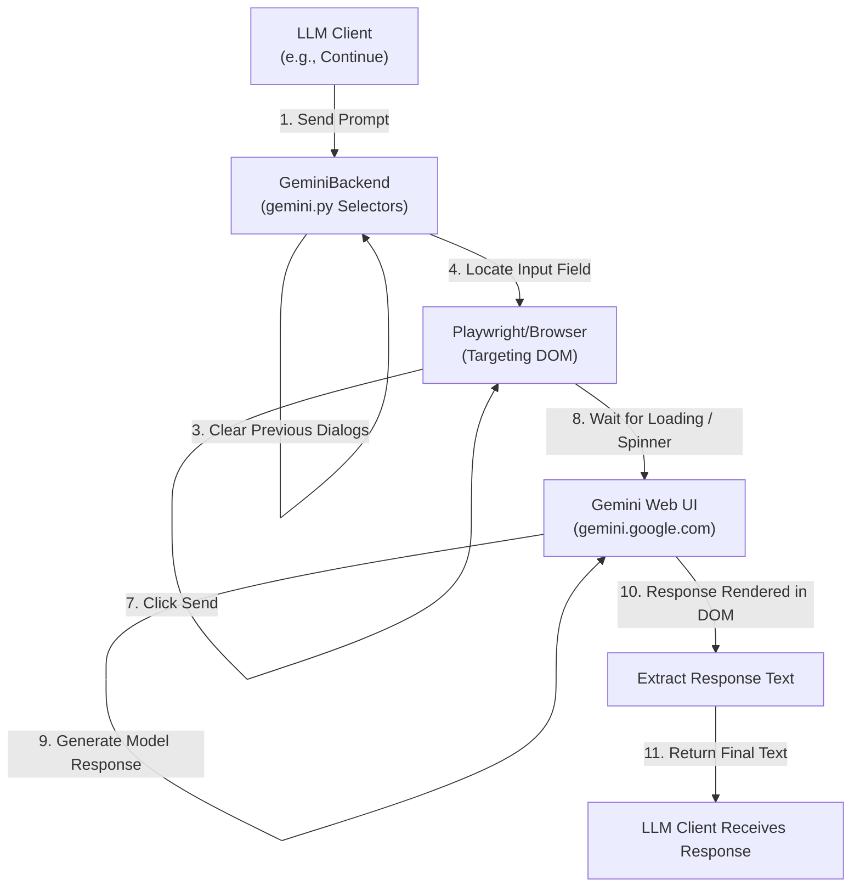

# 🌐 Browser_Ai V0.8

**Browser_Ai is an asynchronous, Playwright-backed automation bridge that transforms public AI ChatBot web interfaces into a local OpenAI-compatible API server.**

**Use public LLM reasoning and context windows within tools like Continue, Cursor, or custom LLM scripts without the need for a public-facing API key.**

---
>**DISCLAIMER: All tools in use for Browser_Ai are publicly available, openly sourced, tools are are beholden to their respective license agreements. All LLM interfaces accessed by Playwright are to be used in accordance with their respective Terms of Service, and with respect to relevant regulations. Use Browser_Ai at your own discretion.**
---

## Supported backends
 
| Backend    | Status        | Default mode        | URL                              |
|------------|---------------|---------------------|----------------------------------|
| `gemini`   | ✓ working     | headless            | https://gemini.google.com/app    |
| `chatgpt`  | ✓ working     | visible + minimized | https://chatgpt.com              |
| `perplexity` | stub only   | headless            | https://www.perplexity.ai        |

> **Why does ChatGPT run in a visible window?**  
> ChatGPT reliably detects headless Chromium and degrades the session — either
> serving a stripped DOM or silently blocking responses. The only reliable fix
> is a real browser window. `browser_ai` automatically minimizes it so it
> stays out of your way. You'll see a brief flash when the window opens, then
> it moves off-screen. Use `--no-headless` to keep it visible for debugging.

## Coming Soon

* Generalized Agent Framework
* Open-WebUI Support
* Multi-port serving
* Dockerized Deployment
* Free and Ephemeral (Non-Signed-In LLM Sessions) with:
    * Perplexity

## ✨ Key Features

- **OpenAI-Compatible API**: Implements `/v1/chat/completions` and `/v1/models` for seamless drop-in integration.
- **Smart Context Reordering**: Automatically moves large code blocks to the end of user prompts to prioritize instruction clarity.
- **High-Speed Injection**: Uses clipboard-level injection for large payloads, bypassing slow character-by-character typing.
- **Session Management**: Intelligent handling of browser lifecycles, idle timeouts, and concurrent request locking.
- **Markdown Preservation**: A custom DOM walker reconstructs structured Markdown (code fences, headings, etc.) directly from the browser page's UI.
- **Flexible Rendering**: Support for both Headless (silent) and Visible (interactive) browser modes.

## Example Architecture for Basic Chat


## 🛠 Prerequisites

- Python 3.8+
- Playwright Browsers: Specifically Chromium.

## 📦 Installation

```bash
# Clone
git clone https://github.com/VOID1793/browser_ai
cd browser_ai/src
 
# Install (inside a venv is recommended)
pip install -e .
 
# Install Playwright's Chromium browser
playwright install chromium
```

## 🚀 Usage

## Quick start
 
```bash
# Gemini (headless — recommended default)
browser-ai serve --backend gemini --compat continue
 
# ChatGPT (opens a minimized browser window automatically)
browser-ai serve --backend chatgpt --compat continue

# You can also chat directly with the backend in your terminal
browser-ai chat --backend gemini "<your prompt here>"
 
# See all options
browser-ai serve --help
browser-ai backends
```

### 3. Integration
 
Add to your `~/.continue/config.yaml`:
 
```yaml
models:
  - name: Gemini Browser
    provider: openai
    apiBase: http://127.0.0.1:8000/v1
    model: browser-ai
    apiKey: not-needed
    roles:
      - chat
      - edit
 
  - name: ChatGPT Browser
    provider: openai
    apiBase: http://127.0.0.1:8000/v1
    model: browser-ai
    apiKey: not-needed
    roles:
      - chat
      - edit
```

> **Important:** The model name **must** be `browser-ai`. The server advertises
> this name in `/v1/models` and echoes it in responses. Continue drops
> responses where the echoed model doesn't match the config.

## CLI reference
 
```
browser-ai serve [--backend {gemini,chatgpt,perplexity}]
                 [--compat {continue}]
                 [--host HOST] [--port PORT]
                 [--headless | --no-headless]
 
browser-ai chat  [--backend {gemini,chatgpt,perplexity}]
                 [--headless | --no-headless]
                 [--session]
                 [PROMPT]
 
browser-ai backends
```

### Headless flags
 
| Flag | Effect |
|------|--------|
| *(none)* | Uses the backend's default (`gemini` → headless, `chatgpt` → visible+minimized) |
| `--no-headless` | Force a visible browser window (useful for first-time login / debugging) |
| `--headless` | Force headless mode (may not work for all backends) |
 
---
 
## Smoke test
 
```bash
curl -s http://127.0.0.1:8000/v1/chat/completions \
  -H "Content-Type: application/json" \
  -H "Authorization: Bearer test" \
  -H "X-Session-Id: smoke-test" \
  -d '{"model":"browser-ai","messages":[{"role":"user","content":"What is 2+2?"}],"stream":false}' \
  | python3 -m json.tool
```
 
Expected: `choices[0].message.content` contains a response.
 
---
## 🛠 Project Structure

```
browser_ai/src/
├── pyproject.toml
└── browser_ai/
    ├── config.py            # Global tunables
    ├── models.py            # Pydantic request/response models
    ├── cleaning.py          # Response text cleaning + DOM text extraction
    ├── prompt.py            # Prompt construction + history tracking
    ├── tools.py             # Tool call serialization / extraction / rescue
    ├── session.py           # SessionState + SessionManager
    ├── server.py            # FastAPI app + all routes
    ├── cli.py               # browser-ai CLI entry point
    ├── backends/
    │   ├── base.py          # BrowserBackend ABC + BaseBrowserBackend
    │   ├── gemini.py        # ✓ working
    │   ├── chatgpt.py       # ✓ working (visible+minimized)
    │   └── perplexity.py    # stub
    └── compat/
        └── continue_compat.py   # Continue-specific patches
```
### Adding a new backend
 
1. Create `browser_ai/backends/<name>.py`
2. Subclass `BaseBrowserBackend`
3. Set `label`, `URL`, and the four selector lists
4. Optionally set `DEFAULT_HEADLESS = False` + `MINIMIZE_WINDOW = True` if the site detects headless
5. Register in `browser_ai/backends/__init__.py`
6. Add to `--backend` choices in `cli.py`
 
---
 
## Session management
 
Sessions are keyed by a hash of `(Authorization header, X-Session-Id header, user field)`. Different callers get isolated browser tabs automatically. Sessions expire after 30 minutes of idle time.
 
To force a session reset from a client, send `X-Reset-Session: 1`.
 
---
 
## Known limitations
 
- **No authentication passthrough** — sessions are always anonymous (logged-out) by design.
- **No parallel requests per session** — each browser tab handles one request at a time. Multiple concurrent callers each get their own tab.
- **Token counts are estimates** — the usage field returns heuristic char/4 estimates, not real token counts.

## 📜 License

### MIT